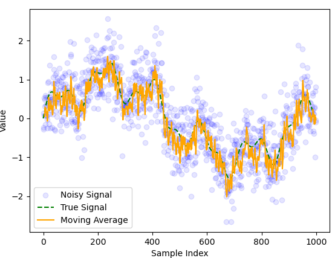
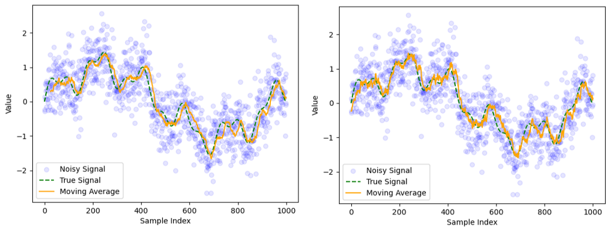
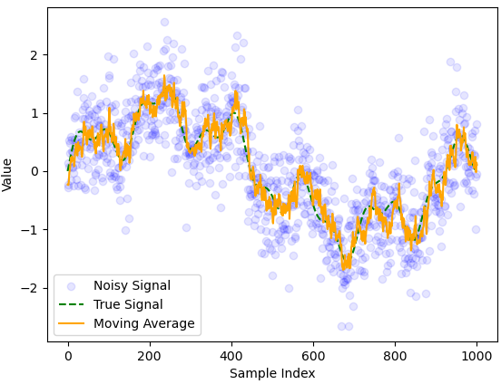
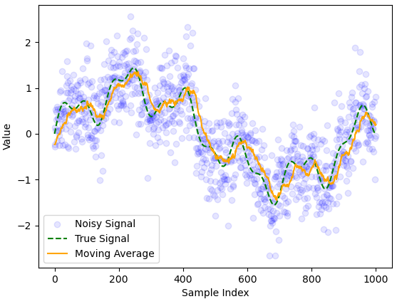
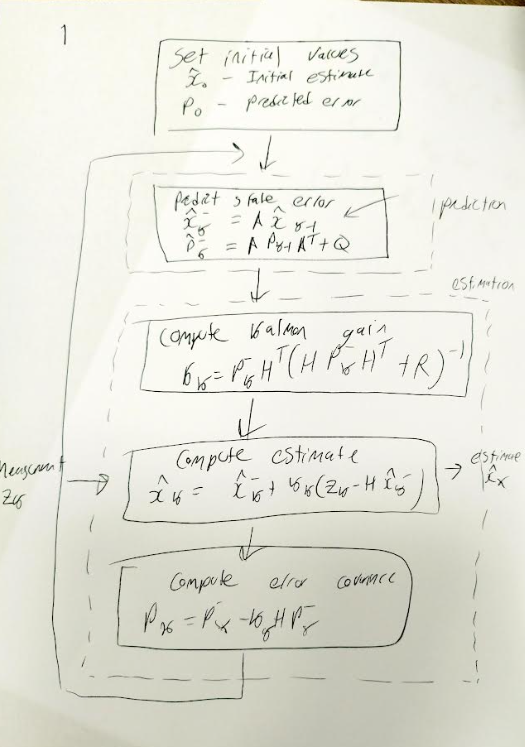
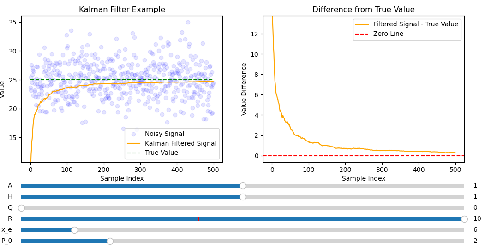
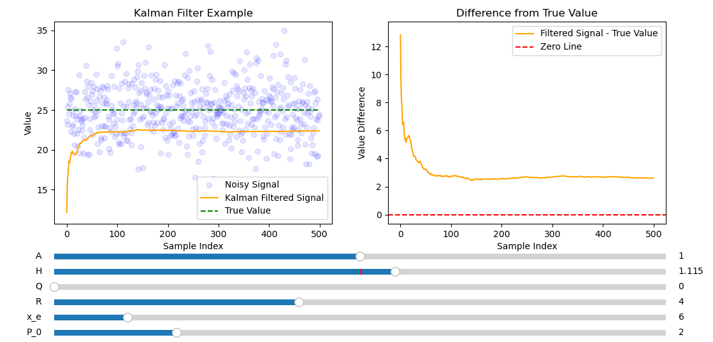
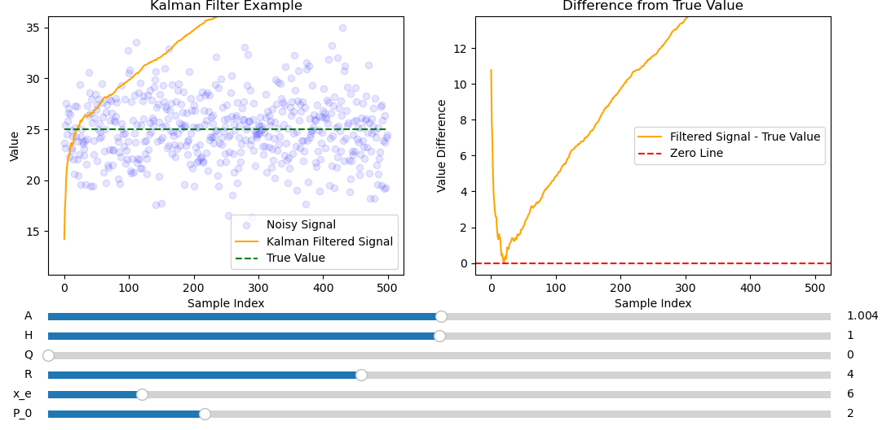

# Inertial Measurement Unit (IMU) and Kalman Filters

## Sensors

IMU measures: angular rotation, force and magnetic field, measured using a: gyroscope, accelerometer and a magnetometer respectively. Each of these measurements has serious issues: the accelerometer is easy to confuse with shaky motion but is accurate with slow steady motion, the magnetometer will lose its pointing accuracy over time but is accurate in shaky motion. These problems are rectified using sensor fusion.

## Kalman Filters

Kalman filters are a form of optimal estimation algorithm. The measurements from gyroscope, accelerometer and magnetometer are each prone to drift over time. However by combining these sensors it is possible for our estimates to converge towards the real value. The state observer $\hat{x}$ represents the estimated state vector from a set of measurements ($z$) which include noise. 

### 1 Recursive Average filters

The estimated state (in this case the mean state) is evaluated as:

\[ 
    \hat{x}_k = \frac{z_1+z_2+z_3+...+z_k}{k} \tag{1.1}
\] 

Which can be written recursively as:
\[ 
    \hat{x}_k = (\frac{k-1}{k})\hat{x}_{k-1} + \frac{z_k}{k} \tag{1.2}
\]
which is more efficent to compute.

Let $\alpha \coloneqq \frac{k-1}{k}$ equation (1.2) can be rewritten as:

\[
    \hat{x}_k = \alpha \hat{x}_{k-1} + (1 - \alpha) z_k \tag{1.3}
\]

This is an example of an recursive (average) filter. 

_figure 1.1: A noisy signal with mean 25 and standard deviation 0.5._
The filter is efficient and converges to the correct value very quickly. Due to random variation the filter fluctuates around the correct value. For obvious reasons this filter will not work for a constantly varying signal.

### 2 Moving Average filters

The moving average $\hat{r}_n$ is used to remove noise over a constantly varying signal. Here $n$ represents the index of the moving average and $k$ represents the window size.

\[
    \hat{x}_n = \frac{z_{n-k+1} + z_{n-k+2}+...+z_n}{k} \tag{2.1}
\]

$\hat{x}_n$ can be written recursively as:

\[
    \hat{x}_n = \hat{x}_{n-1} + \frac{z_n - z_{m-k}}{k} \tag{2.2}
\]

_Figure 2.1: Moving average filter applied to a noisy signal with $k = 25$_
The moving average lags behind the true signal but has roughly the right shape.

_Figure 2.2 Moving average filter applied to a noisy signal with $k=5$._
In this example the delay is smaller but less noise is removed. There is a tradeoff between noise reduction and minimizing delay limiting the reliability of the moving average filter. 
All terms in $(2.1)$ have equal weighting ($1/n$). However it makes more sense to give more recent terms a larger weighting.

### 3 Low pass filter

A low pass filter is an improvement on the moving average filter it allows low frequencies to pass through but filters out high frequencies. Noise is usually high frequency. Below is an example of a first order low pass filter.

\[
    \hat{x}_k = \alpha \hat{x}_{k-1} + (1 - \alpha) z_k \quad 0<\alpha<1 \tag{3.1} 
\]
Looks like expression (1.3) except here $\alpha$ is a free parameter to be chosen. It is also true that:
\[
    \hat{x}_{k-1} = \alpha \hat{x}_{k-2} + (1 - \alpha) z_{k-1} \quad 0<\alpha<1 \tag{3.2}
\]
Combining these equations helps to overcome some problems associated with the moving average since more distant terms disappear exponentially quickly:

\[
    \hat{x}_k = \alpha^2 \hat{x}_{k-2} + \alpha(1-\alpha) z_{k-1} + (1-\alpha)z_k \quad 0<\alpha<1 \tag{3.3}
\]
Due to the restriction on alpha larger $n$ means greater weighting on $\hat{x}_n$ since $\alpha(1-\alpha)\leq 1-\alpha$. Previous data gets weighted exponentially less. 

_Figure 3.1 On the left is the moving average filter from figure 2.1 on the right is the low pass filter with optimized $\alpha = 0.9$ by eye._
The low pass filter has a smaller delay compared to the moving average filter. However the low pass filter didn't remove as much noise as the moving average filter did.

_Figure 3.2: Low pass filter with $\alpha = 0.8$_
Here the delay is less significant but the filter doesn't remove as much noise as it did when $\alpha = 0.9$, since the moving average is more easily influenced by more recent measurements.

_Figure 3.3 Low pass filter with $\alpha = 0.95$_
Here the delay is more significant since results are given more similar weightings, hence figure 3.3 looks most similar to the moving average filter but with a smaller delay. The choice of $\alpha$ represents a tradeoff between a noisy signal and a delayed signal, meaning there is an optimal choice of $\alpha$ exists ensuring that the overall effects of both are minimized.

### 4 Kalman filters

**Kalman filter is essentially a low pass filter with a dynamically changing $\alpha$**.  States can be different usually measurements. External input $z_k$ (measurement), final output $\hat{x}_k$ (estimate), final output $\hat{x}^-_k$ (prediction), error covariance $P_k$ (estimate), error covariance $P_k^-$ (prediction) system model A, H, Q and R all others are used for internal computation. A prediction is a forecast of the next state based on the previous state and the mathematical model whereas a estimate is an update of the predicted state once new measurements have been taken.

#### Estimation step
Computation of an estimate (where $x_k$ is a $n\times1$ column vector) can be written as:
\[
\hat{x}_k = \hat{x}^-_k + K_k(z_k-H\hat{x}^-_k) \tag{4.1}
\]

rewritten as
\[
\hat{x}_k = (\mathbb{I} + K_kH)\hat{x}_k + K_kz_k \tag{4.2}
\]

Letting $H = \mathbb{I}$ and $\alpha= 1-K_k$ a first order low pass filter is recovered similar to (3.1).

\[
\hat{x}_k = \alpha \hat{x}^-_{k-1} + (1 - \alpha) z_k \tag{4.3} 
\] 

**Kalman filter estimation process is like a low pass filter with dynamically changing $\alpha$ (or equivalently gain $K_k$)** The gain gets updated in time according to $K_k$:

\[
K_k = P^-_kH^T(HP^-_kH^T+R)^{-1} \tag{4.4}
\]

The error covariance (a measure of the inaccuracy of the estimate) is updated as:
\[
P_k = P^-_k-K_kHP^-_k \tag{4.5}
\]
The true state is $x_k \sim N(\hat{x}_k, P_k)$ $\hat{x}$ is the mean and $P_k$ is the variance. *R and H are only in the estimation step*

#### Prediction step
Using the model $\hat{x}_{k+1}$ can be predicted from the state at time $t_k$, $\hat{x}^-_{k+1} = A\hat{x}_{k}$, where A is a $n\times n$ matrix. Similarly $P^-_k = AP_kA^T + Q$. Where $Q$ is the process noise or state transition noise. This means (4.1) can be rewritten as:

\[
\hat{x}_k = A \hat{x}_{k-1} + K_k(z_k-HA \hat{x}_{k-1}) \tag{4.6}
\]
*A and Q are only in the prediction step*
#### Linear model
Whereas the low pass filter passes $\hat{x}_{k-1}$ directly between time steps $t_{k-1}$ and $t_{k}$ the kalman filter predicts the next step before a measurement is carried out to produce a new estimate.

The kalman filter deals with the linear state model. Where the state $x_{k+1} = Ax_k + w_k$ and the measurement $z_{k+1} = Hx_k + v_k$. 
- $x_k$ is the state variable ($n\times1$ column vector)
- $z_k$ is the measurement ($m\times1$ column vector). 
- $A$ is the state transition matrix ($n\times n$ matrix)
- $H$ is the state to measurement matrix ($m \times n$ matrix).
- $w_k$ is the linear process noise ($n\times1$ column vector)
- $v_k$ is the linear measurement noise ($m\times1$ column vector)
- $Q$ is the covariance matrix of $w_k$ ($n\times n$ diagonal matrix)
- $R$ is the covariance matrix of $v_k$ ($m\times m$ diagonal matrix)

**Example 1: using a kalman filter to fit a constant signal e.g. the output from a battery**
- $n = 1$ since state is a scalar, $m = 1$ since measurement is a scalar
- Assume no linear process noise ($w_k$ = 0) hence $Q = 0$ and $x_{k+1} = Ax_k$ since the voltage stays the same $x_k = x_{k+1}$ therefore $A=1$
- There measurement sensor directly observes the voltage therefore $H = 1$
- Tried different values of $R$ since there is still linear measurement noise.

_Figure 4.1: Kalman filter used to successfully fit the a non varying signal with a large amount of noise._
Figure 4.1 shows the rate of convergence is exponentially fast and much more smoother than the average filter making it easy to extrapolate to infinity.

_Figure 4.2: Figure 4.1 but with smaller R_
Figure 4.2 shows smaller R appears to make the rate of convergence faster but after 500 samples it is further from the mean than when $R=4$.

_Figure 4.3 but with larger R._
Figure 4.3 shows slower convergence than figures 4.1 and 4.2 but has the smoothest convergence of the three. Figure 4.1 seems to be best as it has a good tradeoff between a noise free filtered signal and fast convergence.

_Figure 4.4: Figure 4.1 with H set to $1.115$ rather than $1$._
Varying H will lead to the kalman filter converging to the wrong value since the measurement directly measures the state only satisfied by $H = 1$.

_Figure 4.5 Figure 4.1 with A set to 1.004 rather than 1._
This causes the kalman filter to diverge since only $A=1$ describes a straight line.
 
_Figure 4.6 Figure 4.1 except with $Q = 0.817$ rather than 1_
Setting Q to anything other than $0$ in this example makes the filtered signal noisy since the filter is expecting linear process noise which doesn't exist in this model because of the way it was defined..

**Example 2: estimating velocity from position**
- $m = 2$ since $x_k = \begin{bmatrix}
s \\
v
\end{bmatrix}_k$ where $s$ is the position and $v$ is the velocity.
- $n = 1$ since $z_k = s_k$

- $A = 
\begin{bmatrix}
1 & \Delta t \\
0 & 1
\end{bmatrix}$ where $\Delta t$ is the time step between measurements
- $H = \begin{bmatrix}
1 &
0
\end{bmatrix}$ since $z_{k+1} = Hx_k + v_k$
- $x_{k+1} = \begin{bmatrix}
s_k + v_k\Delta t \\ v_k 
\end{bmatrix}$
- Q is given $Q = \begin{bmatrix}
Q_s & 0 \\
0 & Q_v
\end{bmatrix} = \begin{bmatrix}
1 & 0 \\
0 & 3
\end{bmatrix}$ 
- $R$ obtained by tuning

