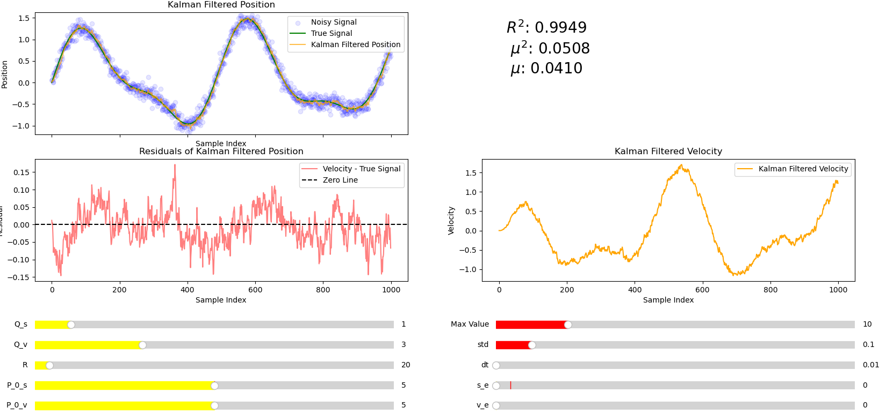
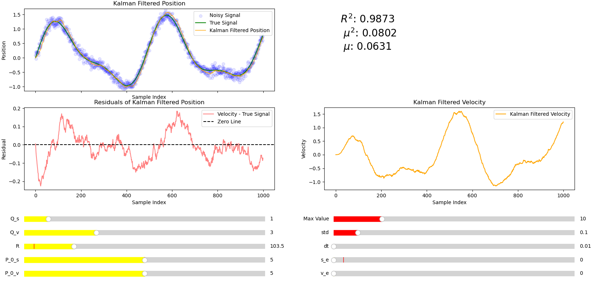
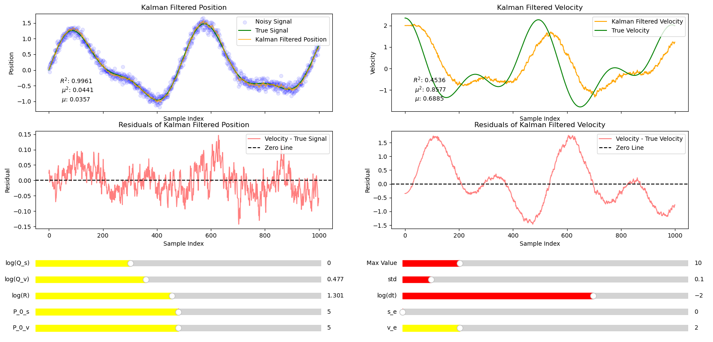

# Inertial Measurement Unit (IMU) and Kalman Filters

## Sensors

IMU measures: angular rotation, force and magnetic field, measured using a: gyroscope, accelerometer and a magnetometer respectively. Each of these measurements has serious issues: the accelerometer is easy to confuse with shaky motion but is accurate with slow steady motion, the magnetometer will lose its pointing accuracy over time but is accurate in shaky motion. These problems are rectified using sensor fusion.

## Kalman Filters

Kalman filters are a form of optimal estimation algorithm. The measurements from gyroscope, accelerometer and magnetometer are each prone to drift over time. However by combining these sensors it is possible for our estimates to converge towards the real value. The state observer $\hat{x}$ represents the estimated state vector from a set of measurements ($z$) which include noise. 

### 1 Recursive Average filters

The estimated state (in this case the mean state) is evaluated as:

\[ 
    \hat{x}_k = \frac{z_1+z_2+z_3+...+z_k}{k} \tag{1.1}
\] 

Which can be written recursively as:
\[ 
    \hat{x}_k = (\frac{k-1}{k})\hat{x}_{k-1} + \frac{z_k}{k} \tag{1.2}
\]
which is more efficent to compute.

Let $\alpha \coloneqq \frac{k-1}{k}$ equation (1.2) can be rewritten as:

\[
    \hat{x}_k = \alpha \hat{x}_{k-1} + (1 - \alpha) z_k \tag{1.3}
\]

This is an example of an recursive (average) filter. 

_figure 1.1: A noisy signal with mean 25 and standard deviation 0.5._
The filter is efficient and converges to the correct value very quickly. Due to random variation the filter fluctuates around the correct value. For obvious reasons this filter will not work for a constantly varying signal.

### 2 Moving Average filters

The moving average $\hat{r}_n$ is used to remove noise over a constantly varying signal. Here $n$ represents the index of the moving average and $k$ represents the window size.

\[
    \hat{x}_n = \frac{z_{n-k+1} + z_{n-k+2}+...+z_n}{k} \tag{2.1}
\]

$\hat{x}_n$ can be written recursively as:

\[
    \hat{x}_n = \hat{x}_{n-1} + \frac{z_n - z_{m-k}}{k} \tag{2.2}
\]

_Figure 2.1: Moving average filter applied to a noisy signal with $k = 25$_
The moving average lags behind the true signal but has roughly the right shape.

_Figure 2.2 Moving average filter applied to a noisy signal with $k=5$._
In this example the delay is smaller but less noise is removed. There is a tradeoff between noise reduction and minimizing delay limiting the reliability of the moving average filter. 
All terms in $(2.1)$ have equal weighting ($1/n$). However it makes more sense to give more recent terms a larger weighting.

### 3 Low pass filter

A low pass filter is an improvement on the moving average filter it allows low frequencies to pass through but filters out high frequencies. Noise is usually high frequency. Below is an example of a first order low pass filter.

\[
    \hat{x}_k = \alpha \hat{x}_{k-1} + (1 - \alpha) z_k \quad 0<\alpha<1 \tag{3.1} 
\]
Looks like expression (1.3) except here $\alpha$ is a free parameter to be chosen. It is also true that:
\[
    \hat{x}_{k-1} = \alpha \hat{x}_{k-2} + (1 - \alpha) z_{k-1} \quad 0<\alpha<1 \tag{3.2}
\]
Combining these equations helps to overcome some problems associated with the moving average since more distant terms disappear exponentially quickly:

\[
    \hat{x}_k = \alpha^2 \hat{x}_{k-2} + \alpha(1-\alpha) z_{k-1} + (1-\alpha)z_k \quad 0<\alpha<1 \tag{3.3}
\]
Due to the restriction on alpha larger $n$ means greater weighting on $\hat{x}_n$ since $\alpha(1-\alpha)\leq 1-\alpha$. Previous data gets weighted exponentially less. 

_Figure 3.1 On the left is the moving average filter from figure 2.1 on the right is the low pass filter with optimized $\alpha = 0.9$ by eye._
The low pass filter has a smaller delay compared to the moving average filter. However the low pass filter didn't remove as much noise as the moving average filter did.

_Figure 3.2: Low pass filter with $\alpha = 0.8$_
Here the delay is less significant but the filter doesn't remove as much noise as it did when $\alpha = 0.9$, since the moving average is more easily influenced by more recent measurements.

_Figure 3.3 Low pass filter with $\alpha = 0.95$_
Here the delay is more significant since results are given more similar weightings, hence figure 3.3 looks most similar to the moving average filter but with a smaller delay. The choice of $\alpha$ represents a tradeoff between a noisy signal and a delayed signal, meaning there is an optimal choice of $\alpha$ exists ensuring that the overall effects of both are minimized.

Thought: For purpouses such as numerical integration is it possible to calculate the delay and then change the bounds of the intergral rather than trying to fit the data with a less smooth curve. 

### 4 Kalman filters

**Kalman filter is essentially a low pass filter with a dynamically changing $\alpha$**.  States can be different usually measurements. External input $z_k$ (measurement), final output $\hat{x}_k$ (estimate), final output $\hat{x}^-_k$ (prediction), error covariance $P_k$ (estimate), error covariance $P_k^-$ (prediction) system model A, H, Q and R all others are used for internal computation. 

A prediction is a forecast of the next state based on the previous state and the mathematical model whereas a estimate is an update of the predicted state once new measurements have been taken.

#### Linear model

The kalman filter deals with the linear state model. Where the state $x_{k+1} = Ax_k + w_k$ and the measurement $z_{k+1} = Hx_k + v_k$, when no forceing function is present. 
- $x_k$ is the process state vector at time $t_k$ ($n\times1$ column vector)
- $z_k$ is the vector measurment at time $t_k$ ($m\times1$ column vector). 
- $A$ is the state transition matrix which maps $x_k$ to $x_{k+1}$ in the absence of a forcing function ($n\times n$ matrix). When a forcing function is present the systems evolutions is effected by an additional term e.g. $x_{k+1} = Ax_k+Bu_k$. Where $B_ku_k$ models the forcing function. Here it is assumed that no forceing function is present. An example of a forcing function is intentionally changing the output from a battery by adding another cell. Note this is not the same as linear process noise.
- $H$ is the state to measurement matrix giving the ideal noiseless connection between the measurement and the state vector at state vector ($m \times n$ matrix).
- $w_k$ is the linear process noise vector ($n\times1$ column vector) which is noise uncorrelated over time (white sequence). Its values at different time steps are independent. E.g. the temperature of a fridge randomly fluctuates due to compressor inefficiencies and unpredictable random temperature shifts.
- $v_k$ is the linear measurement noise vector and is assumed to be a white sequence having zero cross corelation with $w_k$($m\times1$ column vector)
- $Q$ is the covariance matrix of $w_k$ ($n\times n$ diagonal matrix) i.e. how much the true state is expected to deviate from the predictions made by the state transition model. Large Q the filter assumes the model is less reliable and vice versa.
\[
    E[w_kw_i^T] = \begin{cases}
    Q_k, \quad i=k \\
    0 , \quad i \neq k
    \end{cases} \tag{4.7}
\]
- $R$ is the covariance matrix of $v_k$ ($m\times m$ diagonal matrix). $R$ tells the kalman filter how much to "trust" the measurments compared to model predictions. Large R means the measurments are trusted less so the filter relies more on its predictions.

\[
    E[v_kv_i^T] = \begin{cases}
    R_k, \quad i=k \\
    0 , \quad i \neq k
    \end{cases} \tag{4.8}
\]
- $e^-_k$ is the estimation error defined as: $e^-_k = x_k-\hat{x}^-_k$
- $P^-_k$ is then the associated error covariance matrix defined as: $P^-_k =E[e^-_k(e^-_k)^T]$
- $x_0$ is the initial state estimate. provided at the start of the estimation process ($n \times 1$ column vector)
- $P_0$ is the initial error estimate

Thought: For clarity it might be easier to write everything in dirac notation this would make it easier to distinguish what was a vector row  orcolumn and what is a matrix.

#### Estimation step
The prediction $\hat{x}^-_k$ and measuremnt are combined using the blending factor $K_k$ below to determine the updated estimate $\hat{x}_k$.
\[
\hat{x}_k = \hat{x}^-_k + K_k(z_k-H\hat{x}^-_k) \tag{4.1}
\]

**Asside: Connection between kalman filter and low pass filter**

\[
\hat{x}_k = (\mathbb{I} + K_kH)\hat{x}_k + K_kz_k \tag{4.2}
\]

Letting $H = \mathbb{I}$ and $\alpha= 1-K_k$ a first order low pass filter is recovered similar to (3.1).

\[
\hat{x}_k = \alpha \hat{x}^-_{k-1} + (1 - \alpha) z_k \tag{4.3} 
\] 

Kalman filter estimation process is like a low pass filter with dynamically changing $\alpha$ that also considers the physics of the system.

The minimum mean square error is the performance criterion for the kalman filter. It is possible to form an expression for the error covariance matrix associated with the updated estimate:

\[
    P_k=E[e_ke_k^T] = E[(x_k-\hat{x}_k)(x_k-\hat{x}_k)^T]
\]

The gain gets updated in time according to $K_k$:

\[
K_k = P^-_kH^T(HP^-_kH^T+R)^{-1} \tag{4.4}
\]

The error covariance (a measure of the inaccuracy of the estimate) is updated as:
\[
P_k = P^-_k-K_kHP^-_k \tag{4.5}
\]
The true state is $x_k \sim N(\hat{x}_k, P_k)$ $\hat{x}$ is the mean and $P_k$ is the variance. *R and H are only in the estimation step*

#### Prediction step
Using the model $\hat{x}_{k+1}$ can be predicted from the state at time $t_k$, $\hat{x}^-_{k+1} = A\hat{x}_{k}$, where A is a $n\times n$ matrix. Similarly $P^-_k = AP_kA^T + Q$. Where $Q$ is the process noise or state transition noise. This means (4.1) can be rewritten as:

\[
\hat{x}_k = A \hat{x}_{k-1} + K_k(z_k-HA \hat{x}_{k-1}) \tag{4.6}
\]
*A and Q are only in the prediction step*

Whereas the low pass filter passes $\hat{x}_{k-1}$ directly between time steps $t_{k-1}$ and $t_{k}$ the kalman filter predicts the next step before a measurement is carried out to produce a new estimate.

#### Example 1: using a kalman filter to fit a constant signal e.g. the output from a battery
- $n = 1$ since state is a scalar, $m = 1$ since measurement is a scalar
- Assume no linear process noise ($w_k$ = 0) hence $Q = 0$ and $x_{k+1} = Ax_k$ since the voltage stays the same $x_k = x_{k+1}$ therefore $A=1$
- There measurement sensor directly observes the voltage therefore $H = 1$
- Tried different values of $R$ since there is still linear measurement noise.

_Figure 4.1: Kalman filter used to successfully fit the a non varying signal with a large amount of noise._
Figure 4.1 shows the rate of convergence is exponentially fast and much more smoother than the average filter making it easy to extrapolate to infinity.

_Figure 4.2: Figure 4.1 but with smaller R_
Figure 4.2 shows smaller R appears to make the rate of convergence faster but after 500 samples it is further from the mean than when $R=4$.

_Figure 4.3 but with larger R._
Figure 4.3 shows slower convergence than figures 4.1 and 4.2 but has the smoothest convergence of the three. Figure 4.1 seems to be best as it has a good tradeoff between a noise free filtered signal and fast convergence.

_Figure 4.4: Figure 4.1 with H set to $1.115$ rather than $1$._
Varying H will lead to the kalman filter converging to the wrong value since the measurement directly measures the state only satisfied by $H = 1$.

_Figure 4.5 Figure 4.1 with A set to 1.004 rather than 1._
This causes the kalman filter to diverge since only $A=1$ describes a straight line.
 
_Figure 4.6 Figure 4.1 except with $Q = 0.817$ rather than 1_
Setting Q to anything other than $0$ in this example makes the filtered signal noisy since the filter is expecting linear process noise which doesn't exist in this model because of the way it was defined..

#### Example 2: estimating velocity from position
- $n = 2$ since $x_k = \begin{bmatrix}
s \\
v
\end{bmatrix}_k$ where $s$ is the position and $v$ is the velocity.
- $m = 1$ since $z_k = s_k$

- $A = 
\begin{bmatrix}
1 & \Delta t \\
0 & 1
\end{bmatrix}$ where $\Delta t$ is the time step between measurements
- $H = \begin{bmatrix}
1 &
0
\end{bmatrix}$ since $z_{k+1} = Hx_k + v_k$
- $x_{k+1} = \begin{bmatrix}
s_k + v_k\Delta t \\ v_k 
\end{bmatrix}$
- Q is given $Q = \begin{bmatrix}
Q_s & 0 \\
0 & Q_v
\end{bmatrix} = \begin{bmatrix}
1 & 0 \\
0 & 3
\end{bmatrix}$ Where $Q_s$ is the covariance in $s_k$ and $Q_v$ is the covariance in $v_k$.
- $R$ is one dimensional and is obtained by tuning.
- For implementation details, see [4bIntermKalman](4bIntermKalman/Test.py).

_Figure 4.7: Kaman filter setup using parameters above to fit a noisy signal made up from sin waves with varing amplitudes and periods. [4bIntermKalman](4bIntermKalman/GenTestSig.py)._

Although the usmmary statitsics can suggest that something is a good fit they don't tell the whole story. In this case the real data is smooth but some of the filters fit a line which clearly isn't. For a filter to be working it should also fit the shape of the graph. This is important when dealing with derivatives.

Figure 4.7 shows the kalman filter is a good fit for the noisy signal. $R^2$ is large $\mu^2$ represents the root mean squared error and $\mu$ represents the mean absolute error are both small. However the filtered signal is not noise free, see residuals graph. This suggests that the filter is trusting its noisy measurment over its prediction for the next measurment. The residuals graph seems reasonably random so it makes sense to observe the effects incraseing $R$.

_Figure 4.8: Parameters remain the same from figure 4.7 except for increased $R$._

The summary statistics in figure 4.8 suggest that the fit is worse than in figure 4.7. There is a clear delay, this is clear from the residules graph which has peaks after the peaks in the real signal indicating a delay. The data in the residules graph is no longer random indicating the value of $R$ is too high. Despite this the velocity and position fits are significnatly smoother than in figure 4.7. It turns out the optimum $R$ value (with highest $R^2$) for the parameters expressed earlier is used in figure 4.7. However there is a clear tradeoff between having a a smooth fit and having an accurate fit. Smoother fits more accurately represent the true shape of the data. There is less noise in the resduals graph of figure 4.8 (since there is a trend due to the delay in the signal). This makes sense as larger $R$ means predictions are trusted over measurements so the filter is less sensative to noise.

Thought: How is it possible to ensure both a smooth fit whilst minimising lag and ensuring a good fit? Prehaps a machine learning algorithm?

_Figure 4.9: Figure 4.7 with modified Q_c._
Increasing Q_c has had a small incrase on the $R^2$ value but makes the fit less smooth clear from a comparison of the residules. 

_Figure 4.10: Parameters from figure 4.7 with Q_s set to 0_
Figure 4.10 Gives a smoother fit but the fit is worse. All other parameters make little difference in this case

_Figure 4.11 Kalman filters setup to filter noisy signal and output both position and velocity. Note some sliders have been changed to logarithmic scales._
The velocity fit is poor and the filtered signal lags behind the true signal. Since only the velocity signal is lagging Q_v was increased.

_Figure 4.12: Figure 4.11 with increased Q_v_
The filtered signal now lags behind but it is very noisy, this can be fixed by increasing R.

_Figure 4.13: Figure 4.12 with increased R_
By increasing R we have a reasonable fit, although not as good as the position fit, it is expected that some accuracy will be lost when translating from velocty to position. There error when using numerical differentiation to calcualte the filtered velocity is substantially larger than using the kalman filter. 

#### Example 3: Dynamic altitude determination

Using gyroscope (angular velocity) and accelarometer (accelarations) it is possible to determine the altitude of a craft. The relationship between the body angular rates $(\omega_1, \omega_2, \omega_3)$ and the time derivatives of the Euler angles $(\psi, \theta, \phi)$ in the 3-2-1 (yaw-pitch-roll) sequence is. 

\[
\begin{bmatrix}
\dot{\psi} \\
\dot{\theta} \\
\dot{\phi}
\end{bmatrix} =
\frac{1}{\cos{\theta}}\begin{bmatrix}
0 & \sin\phi  & \cos\phi  \\
0 & \cos\phi\cos\theta & -\sin\phi\cos\theta \\
\cos\theta & \sin\phi\sin\theta & \cos\phi  \sin\theta
\end{bmatrix}
\begin{bmatrix}
\omega_1 \\
\omega_2 \\
\omega_3
\end{bmatrix}
\]

