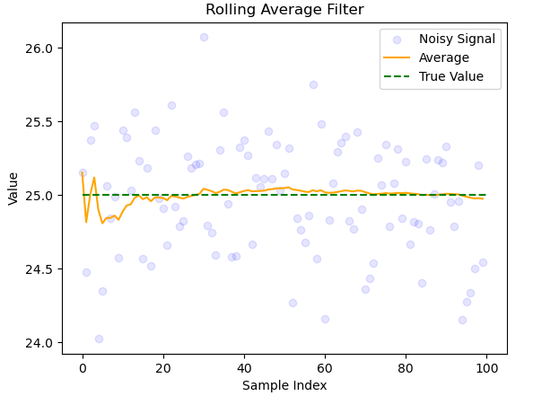

# Average filters

The estimated state (in this case the mean state) is evaluated as:

\[ 
    \hat{x}_k = \frac{z_1+z_2+z_3+...+z_k}{k} \tag{1.1}
\] 

Which can be written recursively as:
\[ 
    \hat{x}_k = (\frac{k-1}{k})\hat{x}_{k-1} + \frac{z_k}{k} \tag{1.2}
\]
which is more efficent to compute.

Let $\alpha \coloneqq \frac{k-1}{k}$ equation (1.2) can be rewritten as:

\[
    \hat{x}_k = \alpha \hat{x}_{k-1} + (1 - \alpha) z_k \tag{1.3}
\]

This is an example of an recursive (average) filter. 

_figure 1.1: A noisy signal with mean 25 and standard deviation 0.5._
The filter is efficient and converges to the correct value very quickly. Due to random variation the filter fluctuates around the correct value. For obvious reasons this filter will not work for a constantly varying signal.