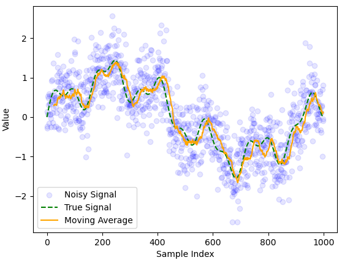

# Moving Average filters

The moving average $\hat{r}_n$ is used to remove noise over a constantly varying signal. Here $n$ represents the index of the moving average and $k$ represents the window size.

\[
    \hat{x}_n = \frac{z_{n-k+1} + z_{n-k+2}+...+z_n}{k} \tag{2.1}
\]

$\hat{x}_n$ can be written recursively as:

\[
    \hat{x}_n = \hat{x}_{n-1} + \frac{z_n - z_{m-k}}{k} \tag{2.2}
\]

_Figure 2.1: Moving average filter applied to a noisy signal with $k = 25$_
The moving average lags behind the true signal but has roughly the right shape.

_Figure 2.2 Moving average filter applied to a noisy signal with $k=5$._
In this example the delay is smaller but less noise is removed. There is a tradeoff between noise reduction and minimizing delay limiting the reliability of the moving average filter. 
All terms in $(2.1)$ have equal weighting ($1/n$). However it makes more sense to give more recent terms a larger weighting.