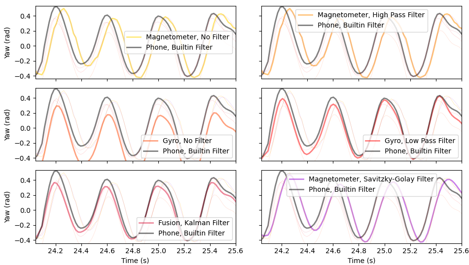

# Quantiative Comparison of Kalman Filter Performance
The Kalman Filter was tested against several other filters to evaluate determine the yaw of a mobile phone. Different filters were applied to the same data, and the results were compared to the data from the phones own filters. The experiment involved two tests: the first the phone oscillated with high frequency by a small amount, the second the phone completed a full rotation.

## Filters
The following filters were compared as well as unfiltered data from the gyroscope and the magnetometer:
**Kalman Filter** (KF): A standard Kalman filter which **fused** data from the magnetometer with gyroscope data with a constant process noise covariance and measurement noise covariance. The tuning parameters were:
  - $Q$: Process noise covariance.
  - $R^m$: Measurement noise covariance for the magnetometer measurements.
  - $R^g$: Measurement noise covariance for the gyroscope measurments.
**[Exponential Moving Average Low Pass Filter](EMAHP.md)** (EMAHPF): Was applied to the **magnetometer** data where the Where $\alpha^{HP}$ is the tuning parameter. 
**Exponential Moving Average High Pass Filter** (EMAHPF): Was applied to **gyroscope data** to cutout integration drift. $\alpha^{LP}$ was the tuning parameter.
**Savitzky-Golay Filter** (SGF): Was applied to the **magnetometer data** to help mitigate random noise. A Savitzky-Golay filter with tuning parameters:
  - $W$: The length of the filter window.
  - $\mathbb{O}$: The order of the polynomial used to fit the samples.
The SGF works by fitting a polynomial of order $\mathbb{O}$ to a wondow of length $W$. The center of the window is the fitted value.

## High frequency oscillation test
The phone was oscillated at a high frequency by a small amount. The results were compared to the results from each filter were compared to the phone's own filters. The tuning parameters were optimised by eye.

```{figure} image-44.png
:label: fig:high_freq_oscillation
Comparison of the phones own filters against the filters described above
```

{numref}`fig:high_freq_oscillation` shows the signal used and gives an overview of the results. Integration drift is visible in the unfiltered gyroscope data. 


```{figure} image-45.png
:label: fig:high_freq_oscillation_zoomed
Zoomed in view of the final few oscillations of the high frequency oscillation experiment
```

{numref}`fig:high_freq_oscillation_zoomed` shows the there is integration drift from the unfiltered gyroscope data but not with the EMAHPF. The signal from the EMALPF and SGF are lagged, this can be caused by exponential moving average filters but is mostly a result of the magnetometer data being lagged. The Kalman filter isn't lagged, the visualy optimised fit assumes a large amount of noise in the magnetometer, $R_m$, two orders of magnitude larger than $R_g$. There is also a small amount of linear process noise this results in a fit which is more reliant gyroscope compared to magnetometer data. 


